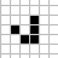
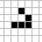

# An Introduction to Functional Reactive Programming

**For Mathew Zaleski's CSC302 (*Software Engineering Large Systems*) course at the University of Toronto, I created and delivered a set of lectures on Functional Reactive Programming.**

The lecture slides are available [here](https://docs.google.com/presentation/d/e/2PACX-1vQ06TaoEe3o9Xu7FluNigjqaKwXreoPj4xYgZ-ZCAw4cXlMSPpEqAH0re11eP2_uzw7N_hpEZ33gWsG/pub?start=false&loop=false&delayms=3000). 
This repo contains the complete code for the demos discussed in the slides.

The [content below](#getting-started-with-functional-reactive-programming) is intended to be a tutorial version of the lectures.

---

## Demos

<table>
  <tbody>
    <tr>
	  <td><a href="https://github.com/gabriellesc/FRP-intro/tree/master/FRP-GOL-init">FRP-GOL-init</a></td>
      <td>A very simple interactive FRP JS implementation of <a href="https://en.wikipedia.org/wiki/Conway's_Game_of_Life">Conway's Game of Life</a>.<br />
      (Modeled directly on the Haskell FRP Game of Life from Tikhon Jelvis' talk, <a href="https://begriffs.com/posts/2016-07-27-tikhon-on-frp.html">A Sensible Intro to FRP</a>.)</td>
    </tr>
    <tr>
	  <td><a href="https://github.com/gabriellesc/FRP-intro/tree/master/FRP-GOL-testable">FRP-GOL-testable</a></td>
      <td>A slightly more complex interactive FRP JS implementation of <a href="https://en.wikipedia.org/wiki/Conway's_Game_of_Life">Conway's Game of Life</a>, <b>structured for improved testability over FRP-GOL-init</b>.</td>
	</tr>
    <tr>
	  <td><a href="https://github.com/gabriellesc/FRP-intro/tree/master/non-FRP-GOL">non-FRP-GOL</a></td>
      <td>An interactive JS implementation of <a href="https://en.wikipedia.org/wiki/Conway's_Game_of_Life">Conway's Game of Life</a>, <b>without using FRP principles</b>.</td>
	</tr>
    <tr>
	  <td><a href="https://github.com/gabriellesc/FRP-intro/tree/master/FRP-twitter">FRP-twitter</a></td>
      <td>An FRP implementation of Twitter's "Who to follow" suggestions box.<br />
	  (Based on an example from Andre Staltz's <a href="https://gist.github.com/staltz/868e7e9bc2a7b8c1f754">The introduction to Reactive Programming you've been missing</a>.)</td>
	</tr>
  </tbody>
</table>

All demos use React.js, and all FRP demos use <a href="https://github.com/baconjs/bacon.js">Bacon.js</a>.

### [FRP-GOL-init](FRP-GOL-init) / [FRP-GOL-testable](FRP-GOL-testable) / [non-FRP-GOL](non-FRP-GOL) contents
<dl>
  <dt>app.js</dt><dd>Game of Life logic (world update functions, etc.)</dd>
  <dt>bundle.js</dt><dd>bundled code produced by the compiler</dd>
  <dt>grid.js</dt><dd>React grid component</dd>
  <dt>index.html</dt><dd>main HTML page</dd>
  <dt>index.js</dt><dd>main app logic, combining the Game of Life logic, React grid component, and app interaction implementation</dd>
  <dt>patternsDict.js</dt><dd>dictionary of Game of Life patterns</dd>
</dl>
        
### [FRP-twitter](FRP-twitter) contents


## How to use this code

| Demo                                 | Running at |
| :----------------------------------: | ---------- |
| [FRP-GOL-init](FRP-GOL-init)         | [gabriellesc.github.io/FRP-intro/FRP-GOL-init/](https://gabriellesc.github.io/FRP-intro/FRP-GOL-init) |
| [FRP-GOL-testable](FRP-GOL-testable) | [gabriellesc.github.io/FRP-intro/FRP-GOL-testable/](https://gabriellesc.github.io/FRP-intro/FRP-GOL-testable) |
| [non-FRP-GOL](non-FRP-GOL)           | [gabriellesc.github.io/FRP-intro/non-FRP-GOL/](https://gabriellesc.github.io/FRP-intro/non-FRP-GOL) |
| [FRP-twitter](FRP-twitter)           | [gabriellesc.github.io/FRP-intro/FRP-twitter/](https://gabriellesc.github.io/FRP-intro/FRP-twitter) |

To run any of the demos locally, simply download its main directory and open index.html.

To modify any of the demos, start by running `npm install` inside its main directory to install the required Node.js modules.  
Build a demo after modifying it by running `npm run build` inside its main directory, or run `npm run watch` to automatically re-build the demo each time it is modified.

Some modifications may require additional Babel plugins to be installed (see [http://babeljs.io/docs/plugins](http://babeljs.io/docs/plugins)).

---

## Getting Started With Functional Reactive Programming

### Conway's Game of Life

- Grid of "alive" and "dead" cells
- In each iteration of the game (a "tick"), cells become dead or alive based on the previous state of the grid:
    - [underpopulation] Any live cell with <2 live neighbours dies.
    - [overpopulation] Any live cell with >3 live neighbours dies.
    - [reproduction] Any dead cell with exactly three live neighbours becomes a live cell.

 

### Implementing the Game of Life

*We need:*
- an **initial state** of the world
- **game logic** (based on the pre-defined rules)
- a **timer** to produce "ticks"

*We also want:*
- a **visual representation** of the world, which gets updated when the state of the world changes
- a way to **interact** with the world (change the state of cells)
- a way to **pause/unpause** the game

### Game logic

We would like to implement the game logic as a **function**, which takes a **previous game state** and produces the **next game state**.

Moreover, we would like to treat the function as a **black box**: it doesn't matter how it is implemented; we can trust that it will correctly produce the next state if we give it the previous state.


This means that we can produce new states forever if we
- start with the initial state, then
- keep feeding the next state back into the function


### Functional Game Logic

What's functional about this model?  
It has no **side effects** (interaction with anything outside the model):
- To produce the next state, the game logic doesn't use anything other than the input it's given (the previous state)
- The game logic doesn't *modify* a global state (or any other external data); it produces a **new** version of the state


What is the advantage of having a functional model?
--> **Testability**

What's the problem with this code?
```
function crazyDouble(x) {
	if (new Date.getDay() == 4)    // if today is Wednesday
		return x*3;
	else
		return x*2;
}

// We'd like to apply crazyDouble to all the elements of a list...
var doubled = []
for (var elem of [1, 2, 3])
	doubled.append(crazyDouble(elem))
```

How do we test `crazyDouble`?
- Side effects make testing much harder - why?
- Are there cases where we need side effects?  
(Pure functional languages don't allow them...)
- Notice that the loop order matters here:  
If it is Wednesday when we start looping, and it stops being Wednesday while we are looping, then some elements will be doubled and some will be tripled - and the result would be different if we looped in a different order!
- So we can't apply `crazyDouble` to the elements in parallel, or in a different order, for optimization...

### Triggering updates

We want to trigger an update (i.e. call our update function)...
- on each tick
- on each click
- (maybe even when other things occur, if we add other functionality?)


Can we treat clicks and ticks as **events**, and implement **event handlers**?
--> What are the challenges of this implementation?
--> How would we test this implementation?

Can we create an **observable** object that holds clicks and ticks, **subscribe** to it, and trigger an update when a click or tick occurs?  
(What is the difference between event handling and observer/observable?)

### Observer/Observable Design Pattern

(Adapted from https://csc301-fall-2016.github.io/resources/lec6-2--2016-10-25.pdf)

- Common design pattern
- Appeared in GoF
- A few names:
  - Observer-Observable
  - Listener
  - Publish-Subscribe
- When something happens to object A, object B gets notified and takes an action
- The two objects care about interfaces (eg. observer and observable), not concrete implementations


#### Observer/Observable - Why?

- **Simple way to decouple modules**
  - An observable doesn't need to know much about its observers
  - As long as the observers implement the observer interface (which is usually very simple), they will get notified whenever something interesting happens
- **Fundamental building block in event-driven architecture**
  - eg. GUI where a user's mouse click raises an event, which triggers various listeners
  - This is a standard way of decoupling GUI (presentation layer) from business logic

### What is reactive programming?

[Wikipedia](https://en.wikipedia.org/wiki/Reactive_programming):  
> ...a declarative programming paradigm concerned with data streams and the propagation of change

[The Reactive Manifesto](https://www.reactivemanifesto.org/):
> Reactive Systems are:
  - Responsive: The system responds in a timely manner if at all possible.
  - Resilient: The system stays responsive in the face of failure.
  - Elastic: The system stays responsive under varying workload.
  - Message Driven: Reactive Systems rely on asynchronous message-passing to establish a boundary between components that ensures loose coupling, isolation and location transparency.

[Introduction to Reactive Programming](https://egghead.io/courses/introduction-to-reactive-programming):
> Reactive programming is programming with asynchronous data streams.

### Modeling data as a stream

At the core of any system are **values**, which exist for some continuous period (eg. variables, pixels, mouse position). We'll refer to these as "**behaviours**".


But computers don't operate continuously (in real time).  
And we're not necessarily interested in behaviours at every point in time (eg. do we always care when the user moves the mouse?).  
So we want to examine certain behaviours, in a way that doesn't depend on time.

We can describe specific conditions on a behaviour, which we'll call "**events**".


Events are discrete (they only occur at specific points in time).

We need a way to model events and have our system handle them...

If we can connect our system to an **input stream**, then we can **add events** to the stream as they occur, and our system can **react** to them as it receives them.


(Notice that our system still has no side effects!)

We don't model time, because the timing of an event doesn't matter to our system!

We are only interested in:
- the relative **order** of events, and
- the state of the system when the event occurs (which itself is only dependent on the initial state and the previous events that have occured)

What if we have multiple kinds of events (eg. clicks and ticks)?

We can create streams of each of these events - and then we can **combine** them (or **create** new kinds of events) using functional patterns.


---

## License
Licensed under the MIT License. See [LICENSE](LICENSE) for more information.
